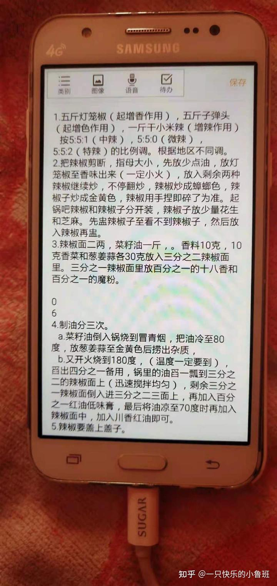

等于是你们一家三口，经营着一家饭店，或者是从业相关类的店，月租金一万，日营业额1200左右。

从账面上来看，你没賺什么钱。

想要放弃，打工还帐。马上又要下半年交房租了。

第一，不见得要放弃，第二一边做一边看。

第三，能捞一点本身是一点。

第四，我觉得你有点货不对版，没有把味道搞出来。

第五点，身为曾经供应整个小镇百分之80的调味品的我，可以给出你一些目前你修改的建议。

1.把产品重新设计，合理利用现有的资源。

2.把菜品的量搞起来，靠走量去打出口碑

3.由于你的装修太“豪华”了导致了一些真正消费群体不敢进去。

4\. 你光会开店，不会运营。怎么办呢？

第一步从调料入手，比如[豆瓣酱](https://zhida.zhihu.com/search?q=%E8%B1%86%E7%93%A3%E9%85%B1&zhida_source=entity&is_preview=1)，是整个川菜的灵魂入手，不要心疼成本，用好的，现在什么世福豆瓣酱30斤一箱的。大概在60左右。这个不理想，用鹃城或者旺丰。都是比较好的牌子。

比如旺丰，可是国宴川菜的指定调料，其中由上过国宴的[兰明路](https://zhida.zhihu.com/search?q=%E5%85%B0%E6%98%8E%E8%B7%AF&zhida_source=entity&is_preview=1)师傅代言。

第二不是所有的花椒都叫茂汶[大红袍](https://zhida.zhihu.com/search?q=%E5%A4%A7%E7%BA%A2%E8%A2%8D&zhida_source=entity&is_preview=1)，不是所有的青花椒都产至于四川洪雅。

第三，不是所有的花椒油都叫五丰黎红，不是所有的[藤椒油](https://zhida.zhihu.com/search?q=%E8%97%A4%E6%A4%92%E6%B2%B9&zhida_source=entity&is_preview=1)都叫幺麻子。

然后改了调料，改了菜品以后。

就是运营，怎么运营呢第一步聊天，也叫做巡台。

既然都卖1200一天了，肯定还是有不少客户的。

来人就问，对于咱家的菜品，你们有没有什么建议。

然后小本本上记下来，一定要改的。

第二服务模式，不在用传统的什么欢迎光临，慢走了。

来人就引导坐下来，来给客人上杯水，吆喝着。

天气热，胃口不好，尤其是烟民，嘴里都麻木了。

直接上一杯淡柠檬水，然后递出来菜单，问几个了，合理安排好。

比如民工兄弟，[来都来了](https://zhida.zhihu.com/search?q=%E6%9D%A5%E9%83%BD%E6%9D%A5%E4%BA%86&zhida_source=entity&is_preview=1)，坐下来先喝杯水，问好几个人，然后推荐一下，菜单上没有的经济小炒，就是你核算过成本以后的。管饱，米饭不收钱。

比如天天来的，有喝酒的，送一杯二两左右的白酒。好的白酒52度的也就是18一斤，折合下来是1.8元左右。

来人消费破一百的，送一碟子西瓜。也就3元左右。

消费满128，送一张优惠券。10块钱的。可以在下次来的时候减了

或者送当场两瓶啤酒，每个一桌，都送一酱汁碟的小菜。

取消餐位费，米饭之前按两元一碗的，改成5元一盆。

在推出一些[江湖菜](https://zhida.zhihu.com/search?q=%E6%B1%9F%E6%B9%96%E8%8F%9C&zhida_source=entity&is_preview=1)，量大，经济，实惠。

比如说，麻辣猪小排，这一份88。一斤半

比如说，大盘鸡68。

比如说，酸菜鱼

比如说，红烧鱼块

等等，菜品不要固定，随季节变化，也要根据适当的减少一些油。

比如夏天最好卖的肯定是拍黄瓜，酸豆角肉末。

青椒炒肉，清炒丝瓜，海带排骨汤，苦瓜酿肉，青椒酿肉，[辣炒花甲](https://zhida.zhihu.com/search?q=%E8%BE%A3%E7%82%92%E8%8A%B1%E7%94%B2&zhida_source=entity&is_preview=1)，香辣土豆丝等等

要弄点活动，学会让利，营造一种吃饭温馨的场景。也是营造一种二次消费的氛围。

比如说，夏天熬两锅绿豆汤，放点冰块，成本不超过30一锅。

放门口，给外卖小哥，环卫工人，还有街头执勤交警。等等，一些个从事高温作业的人。免费提供噢。在放点冰矿泉水，目的就是把人流引到你这里。也是一种免费，带有公益形式的宣传。

三斤绿豆24，加点糖，冰块。可以熬五六十斤。

我在附送一个麻辣小面的教程给你。

你可以卖。

为什么要在门口放个冰箱，弄点水，绿豆汤呢，一方面是做免费的公益，二一个提升店铺的曝光率。

引流，口碑，都是可行性的。

冰箱可以拉赞助，押金1000块钱。

送点330毫升的，550毫升的就行了。

记住了，开店做生意，口碑，口味很重要。

这样别人很快就把你做公益的事传开了。慢慢的你会增加不少人。

或者你私信我，我手把手教你如何引流，运营。

作者：一只快乐的小鲁班
链接：https://www.zhihu.com/question/416440203/answer/2647560343
来源：知乎
著作权归作者所有。商业转载请联系作者获得授权，非商业转载请注明出处。